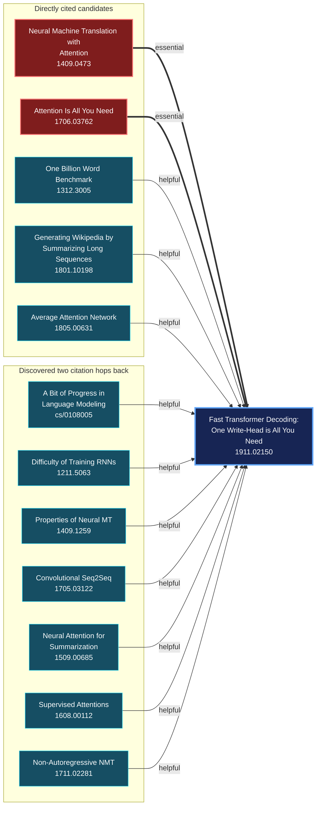

# Knowledge Maps

Knowledge Maps turns an arXiv paper into an evidence-backed prerequisite graph.
It answers one question: **which earlier arXiv papers should someone read to
understand this paper?**

The backend accepts an arXiv ID or URL and returns graph-ready JSON. It does not
summarize PDFs, generate tutorials, or provide a frontend.

## How it works

```text
arXiv paper
    -> metadata and abstract from arXiv
    -> direct references and citation evidence from Semantic Scholar
    -> one model judgment per candidate
    -> one extra citation hop through selected direct prerequisites
    -> validated papers, prerequisite edges, evidence, and provenance
```

The model labels every candidate as `essential`, `helpful`, `related_only`, or
`not_relevant`. Only `essential` and `helpful` candidates become graph edges.
Citation paths explain why a candidate was inspected; citation alone never makes
a paper a prerequisite.

## Complete example

The current pipeline produced this complete map for
[*Fast Transformer Decoding: One Write-Head is All You Need*](https://arxiv.org/abs/1911.02150),
the paper that introduced multi-query attention:



The run returned 13 paper nodes, 12 relationships, and no failed candidates.
This excerpt shows the public response shape:

```json
{
  "target_arxiv_id": "1911.02150",
  "papers": [
    {
      "arxiv_id": "1911.02150",
      "title": "Fast Transformer Decoding: One Write-Head is All You Need"
    },
    {
      "arxiv_id": "1706.03762",
      "title": "Attention Is All You Need"
    }
  ],
  "relationships": [
    {
      "source_arxiv_id": "1706.03762",
      "target_arxiv_id": "1911.02150",
      "relation": "essential",
      "evidence": "The target paper directly references and builds upon the Transformer architecture introduced in 'Attention Is All You Need'...",
      "provenance": {
        "classifier": "model",
        "candidate_source": "semantic_scholar_citation_graph",
        "retrieval_depth": 1,
        "paths": [
          {
            "citations": [
              {
                "source_arxiv_id": "1706.03762",
                "target_arxiv_id": "1911.02150",
                "contexts": [
                  "We introduce multi-query Attention as a variation of multi-head attention as described in [Vaswani et al., 2017]."
                ],
                "intents": ["background", "methodology"],
                "is_influential": true
              }
            ]
          }
        ]
      }
    }
  ],
  "generation": {
    "model": "Qwen/Qwen3-4B-Instruct-2507",
    "complete": true,
    "failed_candidates": []
  }
}
```

`Attention Is All You Need` is the clearest prerequisite: the target modifies
its multi-head attention mechanism. The older attention paper provides conceptual
lineage, while the average-attention paper provides nearby decoding-efficiency
context.

The example also exposes the baseline's main quality problem: the small model is
too permissive with `helpful`. Benchmark and historical papers can enter the map
even when they are not genuine prerequisites. This is why the next milestone is a
small human-reviewed evaluation set, not more infrastructure or a larger graph.

## Run it

Requires Python 3.11+ and a Hugging Face token. A Semantic Scholar API key is
optional but avoids its shared unauthenticated rate limit.

```powershell
python -m venv .venv
.\.venv\Scripts\python.exe -m pip install -e ".[dev]"
Copy-Item .env.example .env
```

Set `HF_TOKEN` in `.env`, then generate JSON directly:

```powershell
.\.venv\Scripts\knowledge-maps.exe build 1911.02150
```

Or run the API:

```powershell
.\.venv\Scripts\uvicorn.exe knowledge_maps.api:create_app --factory
```

```http
POST /knowledge-maps
Content-Type: application/json

{"arxiv_id_or_url": "1911.02150"}
```

Every successful candidate judgment is saved immediately in
`.knowledge_maps/checkpoints.sqlite3`. Identical runs reuse those judgments.
Transient infrastructure failures receive bounded retries, and Hugging Face's
observed rolling limit receives one retry after a 60-second cooldown. Any remaining
candidate failures are returned explicitly under `generation.failed_candidates`.

An uncached citation-heavy paper can take several minutes. The pipeline currently
does not impose a candidate-count cap or truncate abstracts and citation evidence.
