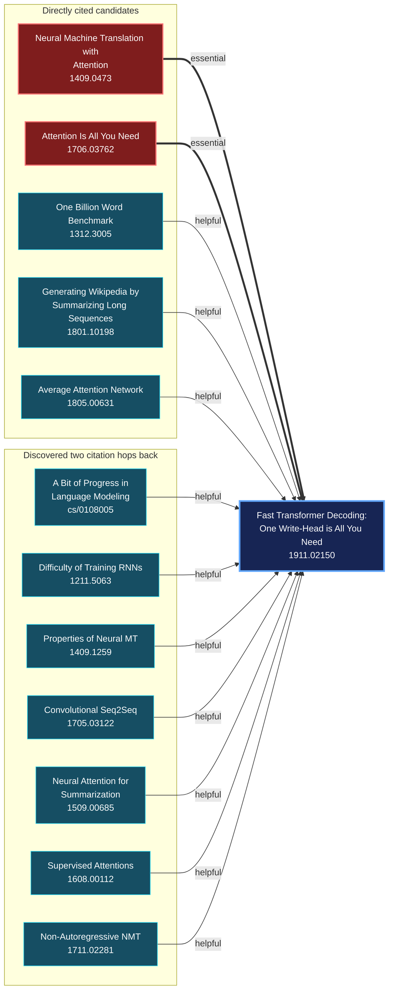

# Knowledge Maps

Knowledge Maps accepts an arXiv ID or URL and returns a directed prerequisite
graph as JSON.

## Pipeline

1. Fetch the target paper's metadata and abstract from arXiv.
2. Retrieve direct references and citation evidence from Semantic Scholar.
3. Classify each candidate as `essential`, `helpful`, `related_only`, or
   `not_relevant`.
4. Expand one additional citation hop through `essential` and `helpful` direct
   candidates.
5. Return selected papers, prerequisite relationships, model evidence, citation
   paths, and generation metadata.

Each relationship points from a prerequisite paper to the requested paper.

## Example

Output for
[*Fast Transformer Decoding: One Write-Head is All You Need*](https://arxiv.org/abs/1911.02150):



This run returned 13 paper nodes, 12 relationships, and no failed candidates.

## Response

```json
{
  "target_arxiv_id": "1911.02150",
  "papers": [
    {
      "arxiv_id": "1911.02150",
      "title": "Fast Transformer Decoding: One Write-Head is All You Need"
    },
    {
      "arxiv_id": "1706.03762",
      "title": "Attention Is All You Need"
    }
  ],
  "relationships": [
    {
      "source_arxiv_id": "1706.03762",
      "target_arxiv_id": "1911.02150",
      "relation": "essential",
      "evidence": "The target paper directly references and builds upon the Transformer architecture introduced in 'Attention Is All You Need'...",
      "provenance": {
        "classifier": "model",
        "candidate_source": "semantic_scholar_citation_graph",
        "retrieval_depth": 1,
        "paths": [
          {
            "citations": [
              {
                "source_arxiv_id": "1706.03762",
                "target_arxiv_id": "1911.02150",
                "contexts": [
                  "We introduce multi-query Attention as a variation of multi-head attention as described in [Vaswani et al., 2017]."
                ],
                "intents": ["background", "methodology"],
                "is_influential": true
              }
            ]
          }
        ]
      }
    }
  ],
  "generation": {
    "model": "Qwen/Qwen3-4B-Instruct-2507",
    "complete": true,
    "failed_candidates": []
  }
}
```

The response includes complete paper metadata. The example above contains only
the fields needed to show the graph contract and one relationship's provenance.

## Installation

Requires Python 3.11+.

```powershell
python -m venv .venv
.\.venv\Scripts\python.exe -m pip install -e ".[dev]"
Copy-Item .env.example .env
```

Set `HF_TOKEN` in `.env`. `S2_API_KEY` is optional.

## CLI

```powershell
.\.venv\Scripts\knowledge-maps.exe build 1911.02150
```

## API

```powershell
.\.venv\Scripts\uvicorn.exe knowledge_maps.api:create_app --factory
```

```http
POST /knowledge-maps
Content-Type: application/json

{"arxiv_id_or_url": "1911.02150"}
```

Successful model judgments are stored in
`.knowledge_maps/checkpoints.sqlite3` and reused when the model, prompt, paper
data, and citation evidence are unchanged.
