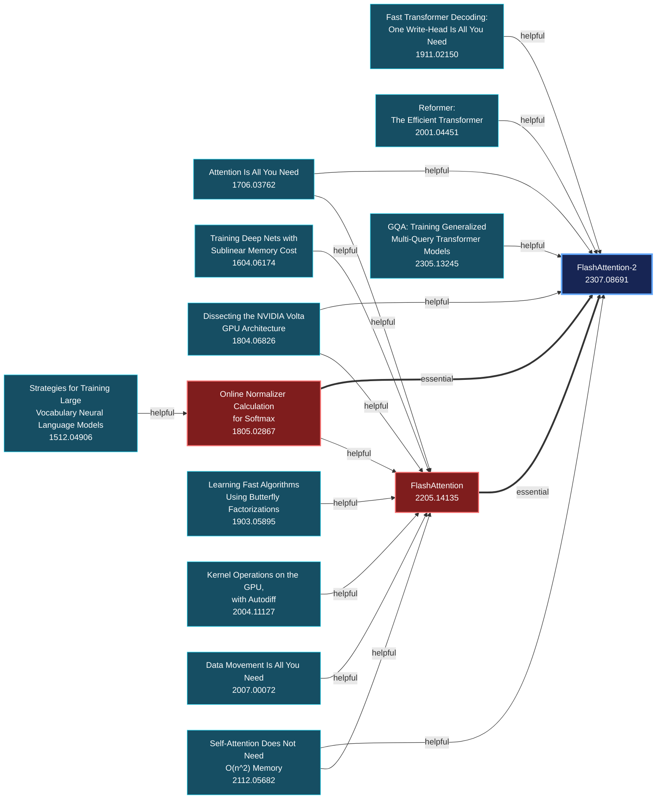

# Knowledge Maps

Knowledge Maps helps readers find the prerequisite arXiv papers they should read
to understand a target paper.

It accepts an arXiv ID or URL and returns a directed prerequisite graph as JSON.

## Pipeline

1. Fetch the target paper's metadata and abstract from arXiv.
2. Retrieve direct references and citation evidence from Semantic Scholar.
3. Classify each candidate as `essential`, `helpful`, `related_only`, or
   `not_relevant`.
4. Expand every `essential` prerequisite and retrieve its references.
5. Classify each deeper candidate against its immediate paper while retaining
   the requested paper and complete citation path as context.
6. Continue until no branch produces another `essential` prerequisite.
7. Return selected papers, prerequisite relationships, model evidence, and
   citation paths.

Each relationship points from a prerequisite to the paper it prepares the
reader for. The resulting graph therefore represents both direct prerequisites
and ordered reading paths.

Traversal has no fixed depth. Each paper is expanded once, citation cycles are
discarded, and `helpful` relationships remain leaves.

## Example

For a query targeting
[*FlashAttention-2: Faster Attention with Better Parallelism and Work Partitioning*](https://arxiv.org/abs/2307.08691),
Knowledge Maps returns this prerequisite graph:



FlashAttention and online softmax are direct prerequisites. The incoming edges
to those papers show the background that prepares a reader for each step.

## Response

An abridged response from the example run:

```json
{
  "target_arxiv_id": "2307.08691",
  "papers": [
    {
      "arxiv_id": "2307.08691",
      "title": "FlashAttention-2: Faster Attention with Better Parallelism and Work Partitioning"
    },
    {
      "arxiv_id": "2205.14135",
      "title": "FlashAttention: Fast and Memory-Efficient Exact Attention with IO-Awareness"
    },
    {
      "arxiv_id": "1805.02867",
      "title": "Online normalizer calculation for softmax"
    }
  ],
  "relationships": [
    {
      "source_arxiv_id": "2205.14135",
      "target_arxiv_id": "2307.08691",
      "relation": "essential",
      "evidence": "FlashAttention-2 directly builds upon the algorithm introduced in FlashAttention, identifies its suboptimal work partitioning, and refines its computational framework.",
      "provenance": {
        "classifier": "model",
        "candidate_source": "semantic_scholar_citation_graph",
        "retrieval_depth": 1,
        "paths": [
          {
            "citations": [
              {
                "source_arxiv_id": "2205.14135",
                "target_arxiv_id": "2307.08691",
                "contexts": [
                  "FlashAttention exploits the asymmetric GPU memory hierarchy to bring significant memory saving and runtime speedup, with no approximation."
                ],
                "intents": ["background", "methodology"],
                "is_influential": true
              }
            ]
          }
        ]
      }
    }
  ]
}
```

The complete response includes every selected paper, relationship, and citation
context.

## Installation

Requires Python 3.11+.

```powershell
python -m venv .venv
.\.venv\Scripts\python.exe -m pip install -e ".[dev]"
Copy-Item .env.example .env
```

Set `HF_TOKEN` in `.env`. To reproduce the example, set:

```dotenv
MODEL_NAME=Qwen/Qwen3-235B-A22B-Instruct-2507:nscale
```

`S2_API_KEY` is optional. `MODEL_BASE_URL` can point the same model interface at
another OpenAI-compatible endpoint.

## CLI

```powershell
.\.venv\Scripts\knowledge-maps.exe build 2307.08691
```

## API

```powershell
.\.venv\Scripts\uvicorn.exe knowledge_maps.api:create_app --factory
```

```http
POST /knowledge-maps
Content-Type: application/json

{"arxiv_id_or_url": "2307.08691"}
```
